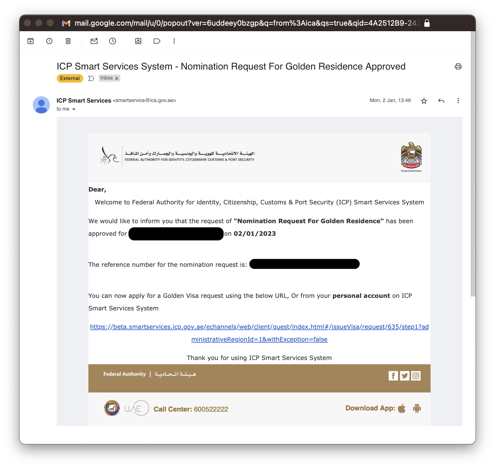

# Guide to getting the UAE Golden Visa (for residents)
This guide explains how to get a Golden Visa (GV) for people who are already residents of the UAE (any emirate). It explains the various stages, what information to submit, and how to sponsor your family.

### Not already a UAE resident?
Some parts of this guide may be helpful but this guide is not intended for you.

### Terminology

In this document, the acronyms FAIC, ICA, and UAEICP will be used interchangably to refer to the _Federal Authority for Identity, Citizenship, Customs & Port Security_.
|Terminology|Description|
|-|-|
|Attested degree|A degree of the rank Bachelor or above that has received 3 stamps.|
|ADRO|Abu Dhabi Residents Office|
|EID|Emirates ID|
|FAIC|Federal Authority for Identity, Citizenship, Customs & Port Security.|
|GV|Golden Visa|
|ICP|Another name for FAIC.|
|PRO|Public Relations Officer. PROs are private sector government liaison and can make your life easier. PROs know the processes back to front, and know who to call when things aren't clear. They are highly recommended but charge a fee.|
|UAEICP|Another name for the FAIC.|

# Process

The statement _"I want a golden visa"_ is vague. It is actually 6 separate milestones as follows:
1. [**Get GV nomination.**](#stage-1-get-gv-nomination) You need to meet the criteria for a GV.
2. [**Apply for GV.**](#stage-2-apply-for-gv) You get the GV for yourself, and cancel your family visas to prepare for their golden visas. You are NOT a Resident yet.
3. [**Change status.**](#stage-3-change-status) You have received the visa in the previous step, but need to perform the logical equivalent of re-entering the country under your new GV. You can achieve this by flying out of the UAE and returning, or simply paying for a _Change Status_ procedure _(highly recommended)_.
4. [**Issue residence.**](#stage-4-issue-residence) Now that you have entered the UAE with your GV, you need to change your status to Resident.
5. [**Residency and Identity Issuance.**](#stage-5-residency-and-identity-issuance) Now that you're a resident, you need to apply for a new EID.
6. [**Applying for GV for your family.**](#stage-6-applying-for-gv-for-your-family) _(If applicable)_. Now that you've got a Golden Visa, you may apply for your family.

This is illustrated as follows.

This document describes how to perform these tasks.

## Stage 1: Get GV nomination
You need a GV nomination. There are multiple nominating authorities including:

* [Abu Dhabi Residents Office (ADRO)](https://www.adro.gov.ae/Visas/Types-of-Visas/Abu-Dhabi-Golden-Visa). If you are an Abu Dhabi resident who earns more than AED 30,000, this is likely your best route. The ADRO website has the [formal criteria required](https://www.adro.gov.ae/Visas/Types-of-Visas/Abu-Dhabi-Golden-Visa/Specialists) to be eligible for a nomination.
* [UAE Ministry of Culture & Youth](https://mcy.gov.ae/en/goldenvisa/)
* [Emirates Council of Scientists](https://science.gov.ae/)
* and many more

Each organisation has its own nomination criteria, so select the organisation with criteria that suits your circumstance. Consult the u.ae website for a [list of nominating authorities](https://u.ae/en/information-and-services/visa-and-emirates-id/residence-visas/golden-visa). For specific details, you will have to visit the website of the individual nominating authority.

### What is a nomination?
This is an recommendation made directly by the nominating authority confirming that you are eligible. For ADRO nominations, they will create a record directly in the FAIC system: there is no physical letter or PDF to collect. This may differ with other nominating authorities.

### How do I get a nomination through the ADRO?

Applying through the ADRO can be done through the [TAMM](https://www.tamm.abudhabi/en/aspects-of-life/visaemiratesid/entryresidencypermits/VisaRequirements/RequestforGoldenVisaNomination) web portal.

> [!NOTE]
> You must be an Abu Dhabi resident to receive an ADRO nomination, but it is not actually necessary to live in Abu Dhabi. You can live in Dubai or another emirate, so long as your existing visa was issued by Abu Dhabi.

When you have applied, you will receive a confirmation email.

ADRO will typically take 2-3 days to review your application. If successful, you will receive an approval email.

ADRO will nominate you to FAIC, and you will receive an automated email from ICA as follows.

Once you have this automated email, you may proceed to the next stage.

## Stage 2: Apply for GV
Once you have a GV nomination, you can proceed to apply (and hopefully receive!) a GV. This is the most complex stage where people get stuck. You can start this process by engaging a PRO, or submitting an application yourself through the ICA Smart Services web portal.

### Formal ICA process name
`VISA - GOLDEN RESIDENCE - PERSONS WHO ARE TALENTED PIONEERS - ISSUE NEW VISA`.

### Who can do this?
PRO or you.

### Process
Once you have uploaded the correct documentation, ICA will analyse your request. If everything is ok with your submission, it will reach _Awaiting Visa/Residency Cancellation_. If not, you request will go in a loop of _Returned for modification_ -> _Re-submitted_ until it is correct or it has been returned 3 times (_Rejected_). If it has been rejected, you must pay the AED 354.57 application fee again to restart stage 2. It is not uncommon for an application to be rejected, so do not panic if this occurs. It does not count against you.

  <i>Illustration of Apply for GV process</i>

### Process stages
|#|Name|Description|Owner|Duration to progress to next stage|
|-|-|-|-|-|
|1|Request submitted|Initial state after you have submitted the form and paid fees. ICA will review your submission.|ICA|1-2 days|
|2|Returned for modification|Your submission will be returned to you if ICA has found errors such as incorrect information or attachments.|You|Waiting on you|
|3|Rejected|If you do not qualify for the GV or have had your application returned 3 times, it will be rejected. You will need to create another submission and pay the fee again.|You|N/A|
|4|Re-submitted|ICA will review your submission again.|ICA|1-2 days|
|5|Awaiting Visa/Residency Cancellation|Your submission is valid. This is a major achievement, congratulations! You now need to cancel the visas of any dependents you have (if applicable) and then your own visa. Once you have terminated all visas, the submission will automatically progress to the _Submitted_ stage. There is no need to notify ICA.|You|As long as it takes for you to cancel visas.|
|6|Under processing|Your submission is being processed. After it is processed, the submission will automatically progress to the _Received_ stage.|ICA|5 minutes|
|7|Received|Your submission has been received. The submission will automatically progress to the _Approved_ stage.|ICA|5 minutes|
|8|Approved|Your Golden Visa has been issued. Congratulations!|ICA|N/A|

### Input
Most information in the Personal Information section will be pre-filled.
|#|Form Section|Information|Comment|
|-|-|-|-|
|1|Identity Information For Sponsored (Service Beneficiary)|Unified Number|Your unified number is a 9 digit number.|
|2|Identity Information For Sponsored (Service Beneficiary)|File Number|A 14 digit number in the form 123/1234/12/12345|
|3|Personal Information|Full name (English)||
|4|Personal Information|Full name (Arabic)||
|5|Personal Information|Current Nationality||
|6|Personal Information|Previous Nationality||
|7|Personal Information|Gender||
|8|Personal Information|Date of Birth||
|9|Personal Information|Birth Country||
|10|Personal Information|Martial Status||
|11|Personal Information|Place of Birth (English)||
|12|Personal Information|Place of Birth (Arabic)||
|13|Personal Information|Mother English Name||
|14|Personal Information|Mother Arabic Name||
|15|Personal Information|Qualification||
|16|Personal Information|Profession||
|17|Personal Information|Religion||
|18|Personal Information|Visit Reason||
|19|Personal Information|Reason for request||
|20|Establishment Details|Establishment Department|The department that provided you a nomination. For example, this will be FEDERAL AUTHORITY FOR IDENTITY & CITIZENSHIP\ABU DHABI|
|21|Establishment Details|Establishment Number|The establishment card number of your company.|
|22|Passport Information|Passport Type|Likely ORDINARY PASSPORT||
|23|Passport Information|Passport No||
|24|Passport Information|Passport Issue Place (English)||
|25|Passport Information|Passport Issue Place (Arabic)||
|26|Passport Information|Passport Issue Date||
|27|Passport Information|Passport Expire Date||
|28|Passport Information|Passport Issue Country||
|29|Addresses Info|Emirate||
|30|Addresses Info|City||
|31|Addresses Info|Area||
|32|Addresses Info|Address in UAE||
|33|Addresses Info|Local Building Name||
|34|Addresses Info|Local Flat Number||
|35|Addresses Info|PO Box||
|36|Addresses Info|UAE Mobile Number||
|37|Addresses Info|Residence Tel||
|38|Addresses Info|Applicant location outside UAE||
|39|Addresses Info|Permanent Mobile Number||
|40|Addresses Info|Permanent Country||
|41|Addresses Info|Email||

### Attachments required
|#|Attachment|Description|
|-|-|-|
|1|BANK STATEMENT|A single PDF containing 6 months of bank statements showing monthly deposits greater than AED 30,000.|
|2|A COPY OF THE PASSPORT OF THE BENEFICIARY OF THE SERVICE|Your passport. Ensure your passport has not expired.|
|3|Proof of Eligibility for Golden Visa|A single PDF containing 6 months of bank statements showing monthly deposits greater than AED 30,000. Yes, this is a duplicate of item 1.|
|4|Health insurance|A PDF with your Health Insurance Certificate of Cover. Ensure your cover has not expired.|
|5|Emirates ID copy|A PDF containing the front and back of your Emirates ID. Ensure your EID has not expired.|
|6|Employment agreement|A PDF of your signed employment contract with your signature and your salary.|
|7|Tenancy contract|A PDF of your Ejari or equivalent. Ensure your document has not expired.|
|8|Colored Photo||
|9|Qualification Certificate (Required for Electrical Engineering)|A PDF of your university degree. Your degree must have the required attestations/stamps, and must be translated into Arabic. The degree must be a Bachelor degree or higher; this may require special translation for countries where formal certifications are government-issued rather than university-issued.|
|10|New salary certificate|A salary certificate from your employer containing your total salary. Your salary must be greater than AED 30,000, and the letter must be dated in the last 60 days. There must be an Arabic translation.|

### Output
When step 8 of this stage is complete, you will receive an eVisa PDF which looks like this. Take note of your _Entry Permit_ and _UID number_. You can download it from the ICA portal.

### Government fees

| Fees Description | Amount (AED) | VAT Amount (AED) 5% | Total with VAT |
| ---------------- | ------------ | ------------------- | -------------- |
| REQUEST FEES     | 100.00       | 0.00                |                |
| ISSUE FEES |100.00 | 0.00 ||
| E-SERVICES FEES | 28.00 | 1.40 ||
| ICP FEES | 122.00 | 0.00 ||
| ELECTRONIC PAYMENT FEES | 4.57 | 0.23 ||
| Total ||| 354.57 AED |

You may incur charges for Arabic translation and degree attestation costs.

> [!NOTE]
> It is recommended that you translate your university degree and salary certificate into Arabic. Both are criteria for Golden Visa, and rejection will cost you time and effort.

## Stage 3: Change status
In the previous stage, your visa was cancelled. At this point, you do not have an active visa and you are currently in the _grace period_. You need to perform the _logical equivalent_ of exiting the UAE and re-entering using an _Entry Permit (EP)_. You can achieve this by flying out of the UAE and returning, or simply paying for a _Change Status_ procedure _(highly recommended)_. When this stage is complete, you will have _"re-entered"_ the country using an _Entry Permit (EP)_.

### Formal ICA process name
`RESIDENCY - ALL RESIDENCE TYPES - CHANGE STATUS - CHANGE STATUS`.

### Who can do this?
PRO or you (through ICA website).

### Input
Stage 2 needs to complete.

### Output
You will receive an _Entry Permit_ PDF file.

### Cost
| Fees Description | Amount (AED) | VAT Amount (AED) 5% | Total with VAT |
| ---------------- | ------------ | ------------------- | -------------- |
| REQUEST FEES    | 500.00       | 0.00                |                |
| E-SERVICE FEES | 28.00 | 1.40 ||
| ICP FEES | 122.00 | 0.00 ||
| ELECTRONIC PAYMENT FEES | 8.47 | 0.42 ||
| Total ||| 658.47 AED |

## Stage 4: Issue Residence
You are now in the country using a temporary _Entry Permit (EP)_. The EP is a visa with 60 days validity which gives you enough time to finalise your residency status which includes a medical test (bloodwork and x-ray). If you believe you are pregnant, the x-ray can be swapped for a pregnancy test.

### How do I book a medical test?
This needs to be performed through [Emirates Health Service (EHS)](https://www.ehs.gov.ae/) using their [Examination of Medical Fitness for Residency Visa](https://www.ehs.gov.ae/en/services/services-directory/examination-of-medical-fitness-for-residency-visa) process. It's important you use EHS because they will upload the results of your medical test directly to ICA.

Go to the [Examination of Medical Fitness for Residency Visa](https://www.ehs.gov.ae/en/services/services-directory/examination-of-medical-fitness-for-residency-visa) page on the EHS website then click **Start Service**. Sign in with your UAE Pass.

Once signed in, change to English.

Under _Examination of Medical Fitness for Residency Visa_, click **Apply Now**.

![EHS webpage in English])(./images/4-frontpage-english.png)

Fill out the booking details. In the section _Eida Number_, enter your **Emirates ID number**. Under _Permit Residence Number_, enter your **Entry Permit No** from your eVisa.

### Formal ICA process name
`RESIDENCY - Golden Residence - PERSONS WHO ARE TALENTED PIONEERS - ISSUE RESIDENCE`.

### Purpose
Get an Emirates ID.

### Input

### Attachments required
You do not need to upload your medical certificate.

|#|Attachment|Description|
|-|-|-|
|1|A COPY OF THE PASSPORT OF THE BENEFICIARY OF THE SERVICE|Your passport. Ensure your passport has not expired.|
|2|Emirates ID copy|A PDF containing the front and back of your Emirates ID. Ensure your EID has not expired.|
|3|Colored Photo||
|4|Entry Permit|A PDF of your Entry Permit|

### Output
|#|Output|Description|
|-|-|-|
|1|PDF reeceipt|This contains your PRAN number.|
|2|Emirates ID copy|A PDF containing the front and back of your Emirates ID. Ensure your EID has not expired.|

### Cost
| Fees Description | Amount (AED) | VAT Amount (AED) 5% | Total with VAT |
| ---------------- | ------------ | ------------------- | -------------- |
| CARD ISSUANCE    | 1,000.00       | 0.00                |                |
| ELECTRONIC PAYMENT FEES | 14.30 | 0.72 ||
| Smart Services Fee | 100.00 | 1.40 ||
| Total ||| 1,115.02 AED |

## Stage 5: Residency and Identity Issuance

### Prerequisites

A medical fitness certificate issued by EHS.

# Input

# Attachments required

### Formal ICA process name
`RESIDENCY - Golden Residence - PERSONS WHO ARE TALENTED PIONEERS - RESIDENCY AND IDENTITY ISSUANCE`.

## Stage 6: Applying for GV for your family
